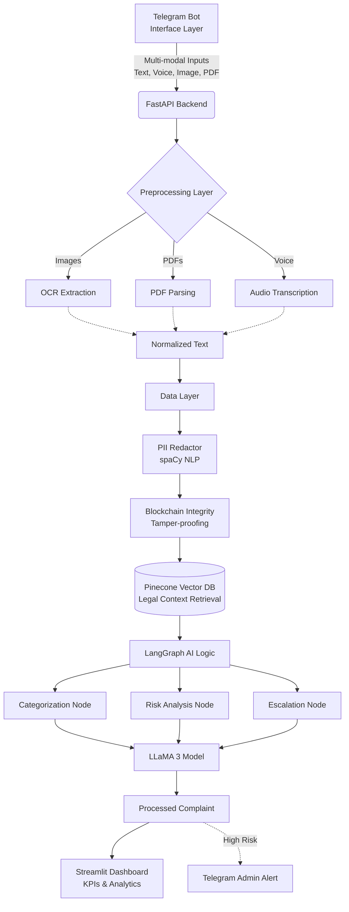

<div align="center">
  <h1>🛡️ C3MS - Anti-Corruption Monitoring Dashboard</h1>
  <p><strong>An advanced, AI-driven, multi-modal anti-corruption reporting platform with blockchain integrity.</strong></p>
</div>

---

## 📖 Overview
**C3MS (Kerala Corruption Reporting Bot)** is a sophisticated complaint management system designed to track, mitigate, and analyze corruption cases securely. By integrating multi-modal data intake (Text, Voice, PDF, Images) via a Telegram Bot, analyzing complaints using Agentic AI (LangGraph & LLaMA 3), and guaranteeing data tamper-proofing through Blockchain Integrity algorithms, C3MS ensures robust, fair, and secure issue resolution.

## 🏗️ Architecture
The system follows a highly modular, decoupled microservices-inspired architecture:



## 🧩 Modules
- **Telegram Interface (`interface_layer/app.py`):** FastAPI + `python-telegram-bot` webhook-driven ingestion point.
- **Data Processor (`data_layer/`):**
  - `pii_redactor`: Masks PII from complaints using NLP (`spaCy`) to ensure user privacy.
  - `blockchain`: Computes cryptographic block hashes for complaint texts, enforcing data integrity.
  - `vector_db`: Interacts with **Pinecone** to seamlessly augment AI with state laws and regulations (Retrieval-Augmented Generation).
- **AI Backend (`backend/logic/`):** Implements a **LangGraph StateGraph** pipeline containing conditional edges to categorize, process, and optionally escalate high-risk complaints.
- **Preprocessing (`preprocessing/`):** Media intelligence layer extending parsing to Images, PDFs, and Voice Messages.
- **Monitoring Dashboard (`dashboard/app.py`):** Real-time analytics, Live Feed UI, and KPIs powered by **Streamlit** and **Plotly**.

## 🧠 AI Usage
C3MS relies on cutting-edge local AI usage tailored to privacy and robustness:
- **Local Large Language Models (LLMs):** Powered by **Ollama (LLaMA 3)** running locally via `llm_wrapper.py` to ensure complete privacy, zero data leakage, and high-quality NLP inferences.
- **Agentic Workflows (LangGraph):** Synthesizes AI tasks through dedicated nodes:
  - `Categorization Node`: Determines the nature of the corruption.
  - `Retrieval Node`: Consults the vector database for related laws.
  - `Risk Analysis Node`: Diagnoses the severity of the submission and flags for escalation.
  - `Escalation Node`: Evaluates conditional bounds and notifies administrators directly inside Telegram.
- **Retrieval-Augmented Generation (RAG):** Employs `sentence-transformers` and **Pinecone** to anchor LLM responses firmly in actual regulations, reducing hallucination bounds.
- **NLP Entity Masking (`spaCy`):** Detects and anonymizes Names, Locations, and Organizations dynamically.

## ⚙️ Setup & Requirements

### Prerequisites
- **Python 3.9+**
- **[Ollama](https://ollama.com/)** running locally with the `llama3` model. Make sure to pull it: `ollama run llama3`
- **Pinecone** Account & API Key
- **Telegram Bot Token** (obtain from BotFather)

### 1. Clone the repository
```bash
git clone https://github.com/AbhijithPM507/ksum-hackathon.git
cd ksum-hackathon
```

### 2. Install Requirements
Install all required Python dependencies globally or in a virtual environment:
```bash
pip install -r requirements.txt
```
Additionally, download the required Natural Language Processing model for `spaCy` PII redaction:
```bash
python -m spacy download en_core_web_sm
```

### 3. Environment Variables
Create a `.env` file in the root directory and map your configuration keys:
```env
TELEGRAM_BOT_TOKEN="your_telegram_bot_token"
ADMIN_CHAT_ID="your_telegram_chat_id"
PINECONE_API_KEY="your_pinecone_api_key_here"
```

### 4. Running the Application
Because of the decoupled nature, you will run the interface API and dashboard independently:

**Terminal 1 — Start the Backend API:**
Start the FastAPI server which manages Telegram Bot webhooks:
```bash
uvicorn interface_layer.app:app --reload
```

**Terminal 2 — Start the Dashboard:**
Start the Streamlit Monitoring Dashboard:
```bash
streamlit run dashboard/app.py
```
> **Note:** The Streamlit dashboard interacts securely with the FastAPI `/complaints` endpoint internally. Ensure the backend is running first.
